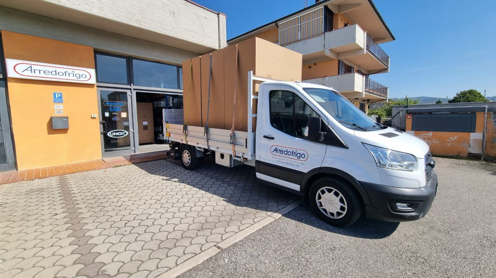
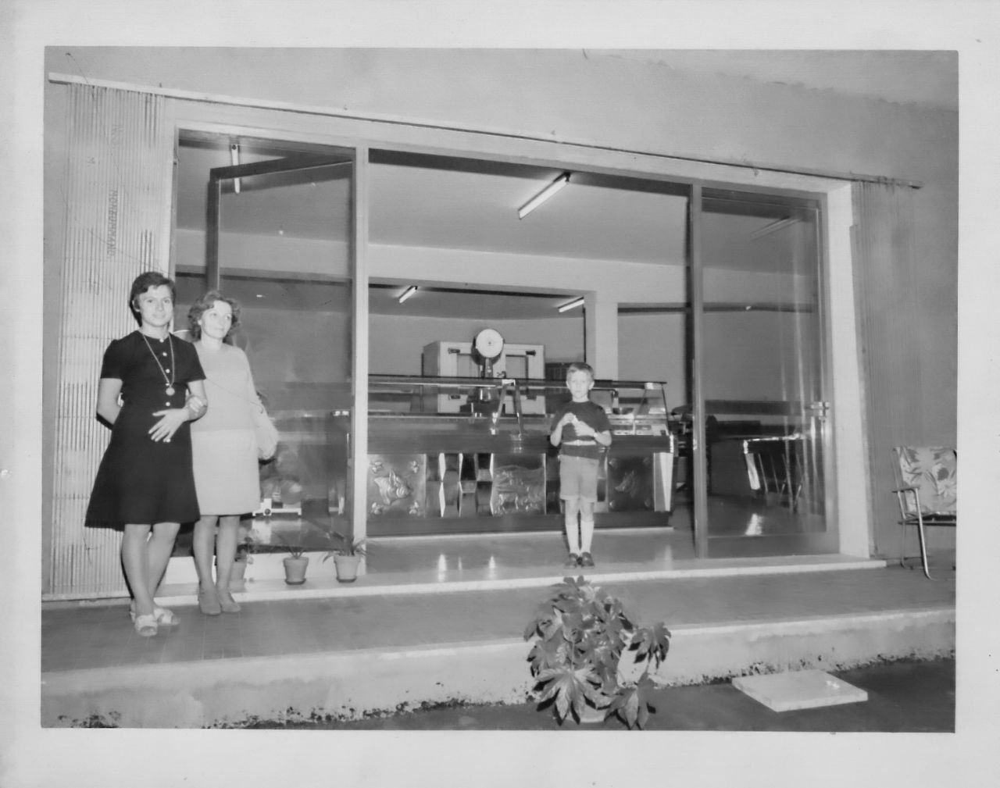
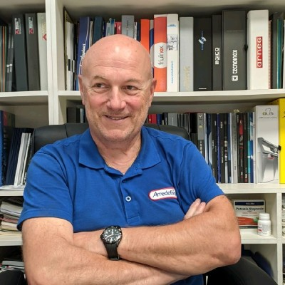

<!-- Hero section con immagine a tutto schermo e titolo sovrapposto -->

  

  
  
Chi siamo

Arredofrigo opera dal 1990 nel settore delle attrezzature e arredamenti per cucine professionali.  
La nostra sede è a Pieve a Nievole, in provincia di Pistoia, e lavoriamo con ristoranti, bar, pizzerie, pasticcerie e attività commerciali in tutta la Toscana.

Ci occupiamo di consulenza, progettazione, fornitura, installazione e assistenza, seguendo ogni fase con attenzione e competenza.  
Ogni soluzione è pensata su misura, tenendo conto delle esigenze pratiche e delle normative del settore.
Lavoriamo con serietà e continuità, offrendo un servizio affidabile e costruito sull’esperienza.  
Il nostro obiettivo è aiutare le attività professionali a lavorare meglio, con attrezzature funzionali e spazi ben organizzati.

---

### Un tuffo nel passato

  

    Siamo nel campo della ristorazione dai suoi albori: nel 1963 nasce Simoni Arredamenti dal'idea di Roberto Pacini, che comincia con la vendita di bilance e affettatrici per le botteghe che stavano nascendo in quegli anni. Con il tempo il business si sviluppa e include anche la vendita di arredamenti e banchi per gastronomia e alimentari. Nel 197x Simoni Arredamenti si sposta nella storica sede alla Colonna e amplia il catalogo dei prodotti trattati a li arredamenti per bar e quindi le cucine per la ristorazione. 
    Nel 1990 passa il testimone a Simone, che con alle spalle le conoscenze dell'attività familiare, apre Arredofrigo: questa volta concentrandosi nell'affiancare il cliente nelle sue richieste e specializzandosi in progettazione e personalizzazione portando l'efficienza produttiva al massimo.
  

  

---

## Il titolare

  

  

    Arredofrigo è stata fondata da Simone Pacini, con l’obiettivo di creare un punto di riferimento serio e competente nel settore delle attrezzature professionali.  
    Fin dall’inizio ha seguito personalmente ogni progetto, con un approccio pratico, diretto e orientato alla qualità del servizio.  
    La sua esperienza e visione continuano a guidare il lavoro dell’azienda ancora oggi.
  

